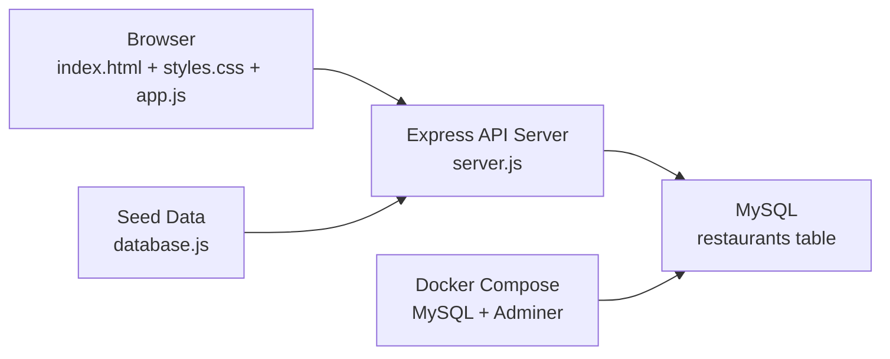

# Gangdong Meal Map

강동역 인근에서 회사 식권으로 이용 가능한 식당을 한눈에 탐색하고, 수정하고, 관리할 수 있도록 만든 treemap 기반 웹앱입니다.

이 프로젝트는 처음에는 정적 데이터 기반 프론트엔드로 시작했지만, 현재는 **Node.js + MySQL 기반의 DB-first 구조**로 마이그레이션되어 실제 데이터 수정, 추가, 삭제가 가능한 형태로 동작합니다.

## 1. 프로젝트 한눈에 보기

이 프로젝트로 할 수 있는 일:

- 아침 / 점심 / 저녁 식당을 treemap 형태로 시각화
- 카테고리별 식당 분포를 한 화면에서 확인
- 식당 클릭 시 상세 정보 확인
- 검색으로 특정 식당 / 메뉴군 빠르게 찾기
- 랜덤 픽 애니메이션으로 오늘 먹을 식당 고르기
- 드래그로 카테고리 이동
- 드래그해서 삭제
- 새 식당 추가 및 기존 정보 수정
- 모든 변경사항을 MySQL에 저장

핵심 아이디어는 간단합니다.

- **왼쪽:** 식당 지도를 보는 공간
- **오른쪽:** 상세 정보와 편집 기능을 모아둔 사이드바
- **서버:** 식당 데이터를 읽고 저장하는 API
- **DB:** 최종 식당 데이터를 영구 저장하는 저장소

## 2. 왜 이 프로젝트를 만들었나

회사 근처 식권 사용 가능 식당이 많아질수록, “오늘 어디서 먹지?”를 결정하는 일이 오히려 어려워집니다.

이 프로젝트는 다음 문제를 해결하기 위해 만들어졌습니다.

- 식당 수가 많아서 한눈에 보기 어렵다
- 아침 / 점심 / 저녁 가능 식당이 다르다
- OCR 기반 원본 리스트에는 오타나 표기 차이가 있다
- 실제로 쓰다 보면 카테고리나 메뉴 정보를 계속 수정해야 한다
- 랜덤 추천이나 카테고리 이동 같은 상호작용이 필요하다

## 3. 현재 아키텍처

현재 구조는 **프론트엔드 + API 서버 + MySQL**의 3계층입니다.



### 아키텍처 설명

- 브라우저는 `app.js`를 통해 `/api/restaurants` 계열 API를 호출합니다.
- 서버는 `server.js`에서 Express와 MySQL을 사용해 데이터를 읽고 씁니다.
- 원본 식당 데이터는 `database.js`에 남아 있으며, **최초 마이그레이션 시 시드 데이터**로만 사용됩니다.
- 이후 실제 운영 데이터는 MySQL `restaurants` 테이블이 기준입니다.

## 4. 기술 스택

### 프론트엔드

- HTML
- CSS
- Vanilla JavaScript
- Canvas 2D API

### 백엔드

- Node.js
- Express
- mysql2
- dotenv

### 데이터 / 인프라

- MySQL 8.4
- Docker Compose
- Adminer

### 디자인 / UI

- Treemap 레이아웃
- Canvas 기반 렌더링
- Noto Sans KR / Noto Serif KR / Song Myung 폰트

## 5. 코드 구조

현재 중요한 파일은 아래와 같습니다.

```text
Playground/
├─ index.html
├─ styles.css
├─ app.js
├─ server.js
├─ database.js
├─ package.json
├─ package-lock.json
├─ docker-compose.yml
├─ .env.example
├─ .gitignore
└─ README.md
```

### 파일별 역할

#### [C:\Users\Andrew\Documents\Playground\index.html](C:\Users\Andrew\Documents\Playground\index.html)

- 전체 UI 골격
- 캔버스 영역과 우측 사이드바 구조 정의
- 식사 토글, 검색, 상세 패널, 편집 폼, 랜덤 선택 UI 포함

#### [C:\Users\Andrew\Documents\Playground\styles.css](C:\Users\Andrew\Documents\Playground\styles.css)

- 전체 레이아웃 스타일
- 아침 / 점심 / 저녁 테마
- 사이드바 카드, 버튼, 폼, 애니메이션 스타일
- tooltip / drag / random pick / detail transition 관련 스타일

#### [C:\Users\Andrew\Documents\Playground\app.js](C:\Users\Andrew\Documents\Playground\app.js)

- 프론트엔드 핵심 로직
- API 호출
- 식당 필터링
- treemap 레이아웃 계산
- canvas 렌더링
- hover / click / drag 이벤트 처리
- 랜덤 픽 애니메이션
- Detail / Edit / Add 패널 연동

#### [C:\Users\Andrew\Documents\Playground\server.js](C:\Users\Andrew\Documents\Playground\server.js)

- Express 서버 실행
- CORS 허용
- 정적 파일 서빙
- MySQL 연결
- 테이블 생성
- 원본 데이터 시드 / 마이그레이션
- 식당 CRUD API 제공

#### [C:\Users\Andrew\Documents\Playground\database.js](C:\Users\Andrew\Documents\Playground\database.js)

- OCR 기반 원본 식당 리스트 보관
- 실제 상호명 corrections
- 카테고리 / 메뉴군 / 대표메뉴 / 태그 프로필
- 현재는 운영 DB의 직접 소스가 아니라 **초기 시드 데이터** 역할

#### [C:\Users\Andrew\Documents\Playground\docker-compose.yml](C:\Users\Andrew\Documents\Playground\docker-compose.yml)

- MySQL 컨테이너
- Adminer 컨테이너
- 로컬 개발용 DB 환경 구성

## 6. 데이터 구조

### 6-1. Seed 데이터 구조

`database.js`는 아래 3개 축으로 구성됩니다.

- `rawSources`
  아침 / 점심 / 저녁 원본 식당 리스트
- `corrections`
  OCR 오타나 다른 표기를 실제 상호명으로 정규화하는 매핑
- `profiles`
  카테고리, 메뉴군, 대표메뉴, 태그 등의 메타 정보

### 6-2. 운영 DB 구조

현재 핵심 테이블은 `restaurants`입니다.

주요 컬럼:

- `id`
  식당 고유 ID
- `name`
  식당명
- `category`
  편집 가능한 카테고리
- `cuisine_group`
  화면 렌더링용 상위 그룹
- `menu_category`
  메뉴군
- `signature_menu`
  대표메뉴
- `tags_json`
  태그 목록
- `aliases_json`
  원본 표기 / 별칭 목록
- `breakfast`, `lunch`, `dinner`
  시간대별 이용 가능 여부
- `is_custom`
  사용자 추가 식당 여부
- `deleted_at`
  소프트 삭제 시각

추가로 과거 구조와의 호환을 위해 아래 테이블도 유지합니다.

- `app_metadata`
- `profile_overrides`
- `custom_restaurants`
- `deleted_restaurants`

이 테이블들은 **마이그레이션 입력 레이어** 역할을 하며, 현재 실사용 기준 테이블은 `restaurants`입니다.

## 7. 마이그레이션 방식

서버 시작 시 `restaurants` 테이블이 비어 있으면 자동으로 초기 마이그레이션이 수행됩니다.

순서:

1. `database.js`에서 원본 식당 목록을 읽음
2. `corrections`를 적용해 실제 상호명 기준으로 통합
3. `profiles`를 적용해 카테고리 / 메뉴 정보를 채움
4. 과거 오버레이 테이블이 있으면 수정값 / 추가 식당 / 삭제 식당을 병합
5. 최종 결과를 `restaurants` 테이블에 적재

즉, **원본 데이터는 보존**하면서도 **운영 데이터는 MySQL 중심으로 전환**한 구조입니다.

## 8. API 구조

현재 제공하는 주요 API:

- `GET /api/health`
  서버 / DB 상태 확인
- `GET /api/restaurants`
  삭제되지 않은 전체 식당 목록 조회
- `POST /api/restaurants`
  새 식당 추가
- `PUT /api/restaurants/:id`
  식당 정보 수정
- `DELETE /api/restaurants/:id`
  식당 삭제(소프트 삭제)

브라우저는 더 이상 `database.js`를 직접 읽지 않고, 이 API만 사용합니다.

## 9. 화면 동작 방식

### Treemap

- 큰 사각형은 카테고리 그룹
- 작은 사각형은 식당
- 면적은 가중치 기반으로 계산
- 테마는 아침 / 점심 / 저녁에 따라 변함

### Detail

- 식당 클릭 시 우측 Detail 패널 갱신
- 랜덤 픽 결과일 때는 더 강한 전환 모션
- 일반 클릭은 더 부드럽고 짧은 전환

### Drag & Drop

- 식당을 다른 카테고리로 드래그하면 카테고리 수정
- 우측 사이드바의 삭제 영역으로 드래그하면 삭제
- 모든 결과는 MySQL에 반영

### Random Pick

- 현재 보이는 식당들만 대상으로 랜덤 선택
- 특정 카테고리만 대상으로도 선택 가능
- 선택 중에는 식당 박스가 순차적으로 강조되다가 최종 식당이 결정됨

## 10. 완전 새 컴퓨터에서 처음 실행하는 방법

아래 절차는 **Git, Node.js, Docker가 하나도 설치되지 않은 Windows 로컬 컴퓨터**를 기준으로 작성했습니다.

### 10-1. 먼저 설치해야 하는 프로그램

이 프로젝트를 실행하려면 아래 3가지가 필요합니다.

1. `Git`
   저장소를 클론하기 위해 필요
2. `Node.js LTS`
   웹 서버와 패키지 설치를 위해 필요
3. `Docker Desktop`
   MySQL과 Adminer를 로컬에서 쉽게 실행하기 위해 필요

권장:

- Git: 최신 안정 버전
- Node.js: LTS 버전
- Docker Desktop: 최신 버전

설치 후에는 PowerShell을 새로 열고 아래 명령으로 확인합니다.

```powershell
git --version
node --version
npm --version
docker --version
docker compose version
```

모두 버전이 출력되면 준비 완료입니다.

### 10-2. 저장소 클론

원하는 폴더에서 아래 명령을 실행합니다.

```powershell
git clone https://github.com/nalalisa/mealMap.git
cd mealMap
```

만약 MySQL 기반 마이그레이션 브랜치를 사용하려면 브랜치도 같이 체크아웃합니다.

```powershell
git checkout codex/mysql-db-migration
```

### 10-3. 환경 변수 파일 만들기

예제 파일을 복사해서 `.env`를 만듭니다.

```powershell
Copy-Item .env.example .env
```

기본값 그대로 써도 현재 프로젝트는 동작합니다.

`.env` 기본 예시:

```env
PORT=3000
DB_HOST=127.0.0.1
DB_PORT=3307
DB_USER=mealmap
DB_PASSWORD=mealmap1234
DB_NAME=mealmap
```

### 10-4. Node 패키지 설치

```powershell
npm install
```

이 명령은 `express`, `mysql2`, `dotenv` 같은 서버 의존성을 설치합니다.

### 10-5. Docker Desktop 실행

Windows에서는 Docker Desktop 앱이 실제로 켜져 있어야 합니다.

체크 방법:

- 작업표시줄 또는 시작 메뉴에서 Docker Desktop 실행
- 완전히 켜질 때까지 잠시 기다림

정상 실행 여부는 아래 명령으로 확인할 수 있습니다.

```powershell
docker ps
```

에러 없이 실행되면 됩니다.

### 10-6. MySQL / Adminer 실행

프로젝트 루트에서 아래 명령을 실행합니다.

```powershell
docker compose up -d
```

이 명령으로 올라가는 것:

- MySQL 8.4
- Adminer

정상 실행 확인:

```powershell
docker compose ps
```

정상이라면 `mysql`, `adminer` 컨테이너가 `Up` 상태로 보입니다.

### 10-7. 웹 서버 실행

이제 Node 서버를 실행합니다.

```powershell
npm start
```

정상 실행 시 콘솔에 비슷한 메시지가 나옵니다.

```text
MealMap server listening on http://localhost:3000
```

### 10-8. 브라우저에서 접속

아래 주소로 접속합니다.

- 앱: [http://localhost:3000](http://localhost:3000)
- Adminer: [http://localhost:8081](http://localhost:8081)

Adminer 접속 정보:

- System: `MySQL`
- Server: `mysql`
- Username: `mealmap`
- Password: `mealmap1234`
- Database: `mealmap`

### 10-9. 서버가 처음 켜질 때 내부에서 일어나는 일

처음 실행 시 서버는 아래 작업을 자동으로 수행합니다.

1. MySQL 연결
2. 필요한 테이블 생성
3. `database.js`의 원본 데이터를 읽음
4. corrections / profiles를 적용함
5. 필요하면 예전 오버레이 테이블도 병합함
6. 최종 식당 데이터를 `restaurants` 테이블에 저장함

즉, 사용자는 별도 SQL을 직접 실행할 필요가 없습니다.

## 11. 이후 다시 켜는 방법

이미 한 번 설치를 마친 뒤에는 아래만 하면 됩니다.

### 11-1. 프로젝트 폴더로 이동

```powershell
cd mealMap
```

### 11-2. DB 실행

```powershell
docker compose up -d
```

### 11-3. 서버 실행

```powershell
npm start
```

### 11-4. 접속

- 앱: [http://localhost:3000](http://localhost:3000)

## 12. 종료하는 방법

### Node 서버 종료

서버를 실행한 PowerShell 창에서:

```powershell
Ctrl + C
```

### Docker 컨테이너 종료

```powershell
docker compose down
```

주의:

- `docker compose down`은 컨테이너를 내리지만, `mysql-data/` 폴더의 데이터는 그대로 남습니다.
- 즉, 다음에 다시 켜도 기존 데이터가 유지됩니다.

## 13. 같은 네트워크의 다른 기기에서 접속하는 방법

이 컴퓨터를 로컬 서버처럼 쓰고 싶다면, 같은 Wi-Fi 또는 같은 사내 네트워크에 있는 다른 기기에서도 접속할 수 있습니다.

### 13-1. 이 컴퓨터의 IP 확인

```powershell
ipconfig
```

여기서 `IPv4 주소`를 찾습니다. 예를 들어:

```text
192.168.0.15
```

### 13-2. 다른 기기에서 접속

다른 기기 브라우저에서 아래처럼 접속합니다.

```text
http://192.168.0.15:3000
```

주의할 점:

- 두 기기가 같은 네트워크에 있어야 합니다.
- Windows 방화벽이 막으면 포트 `3000` 허용이 필요할 수 있습니다.

## 14. 문제 해결

### `npm` 명령이 안 되는 경우

- Node.js가 설치되지 않았거나
- PowerShell을 설치 후 다시 열지 않았을 수 있습니다.

### `docker compose up -d`가 안 되는 경우

- Docker Desktop이 켜져 있는지 확인
- Docker Desktop 초기화가 끝났는지 확인

### `localhost:3000`이 안 열리는 경우

아래 순서로 확인합니다.

1. `docker compose ps`
2. `npm start`
3. [http://localhost:3000/api/health](http://localhost:3000/api/health) 접속

정상이라면:

```json
{"ok":true}
```

가 보여야 합니다.

### 포트 충돌이 나는 경우

다른 프로그램이 `3000`이나 `3307`을 쓰고 있을 수 있습니다.

그 경우 `.env`와 `docker-compose.yml`의 포트를 변경해야 합니다.

## 15. 환경 변수

예시는 [C:\Users\Andrew\Documents\Playground\.env.example](C:\Users\Andrew\Documents\Playground\.env.example)에 있습니다.

주요 값:

- `PORT`
- `DB_HOST`
- `DB_PORT`
- `DB_USER`
- `DB_PASSWORD`
- `DB_NAME`

## 16. 브랜치 전략

- `master`
  기존 정적 버전 보존
- `codex/mysql-db-migration`
  MySQL 기반 실사용 버전 마이그레이션 작업 브랜치

즉, 기존 버전은 그대로 남기고, 현재 서버/DB 기반 버전은 별도 브랜치에서 관리합니다.

## 17. 앞으로 확장하기 좋은 방향

이 구조는 이미 실사용 가능하지만, 앞으로 더 개선하기 좋은 지점도 있습니다.

- `restaurants` 외에 `meal_availability`, `restaurant_aliases`, `restaurant_tags`를 분리한 정규화 구조
- 관리자 인증 추가
- 지도 API 연동
- 사용자별 즐겨찾기 / 평가 / 방문 기록 저장
- 추천 알고리즘 고도화
- 배포 환경 분리

## 18. 요약

이 프로젝트는 단순한 식당 목록 페이지가 아니라,

- **OCR 기반 원본 데이터 보존**
- **DB-first 구조로의 마이그레이션**
- **Canvas 기반 시각화**
- **실제 수정 가능한 운영 데이터**

를 모두 포함한 로컬 실사용용 식당 관리 / 탐색 도구입니다.

처음 보는 사람이라면 아래 순서로 보면 이해가 가장 빠릅니다.

1. `README.md`로 전체 구조 이해
2. `index.html`로 화면 구조 파악
3. `app.js`로 프론트 동작 확인
4. `server.js`로 API / DB 흐름 확인
5. `database.js`로 원본 데이터 구조 확인
